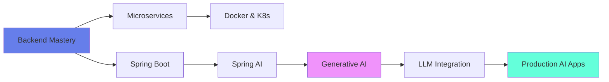

<div align="center">

<!-- Dynamic Header with Particles Effect -->


<!-- Animated Subtitle -->
<div>
  
</div>

<br>

<!-- Custom Badges with Glow Effect -->
<a href="https://www.linkedin.com/in/shravan-parthe-00946b2ab/">
  
</a>
<a href="mailto:shravanparthe@gmail.com">
  
</a>
<a href="#">
  
</a>
<a href="https://github.com/Shravan157">
  
</a>

<br><br>

<!-- Visitor Counter with Style -->


<br><br>

<!-- Animated Divider -->


</div>

<br>

##  The Developer


```javascript
const shravan = {
    name: "Shravan Parthe",
    title: "Backend Engineer & AI Enthusiast",
    education: "TE CSE (AIML)",
    location: "India 🇮🇳",
    
    currentFocus: [
        "🏗️  Architecting Spring Boot Microservices",
        "🧠  Exploring Generative AI & LLMs", 
        "📊  Deep Diving into Machine Learning",
        "☁️  Building Cloud-Native Applications"
    ],
    
    lifePhilosophy: "Code is poetry, AI is the future ✨",
    
    funFact: "I debug with coffee ☕ and deploy with confidence 🚀"
};
```

<br>

### 🎯 **Quick Highlights**

- 💼 Building robust **REST APIs** with Spring Boot & Microservices
- 🤖 Integrating **AI/ML models** into production systems
- 🔐 Implementing **JWT Authentication** & OAuth2
- 📈 Optimizing **Database Performance** (SQL & NoSQL)
- 🐳 Containerizing applications with **Docker**
- ☁️ Deploying on **AWS Cloud Infrastructure**

<br clear="both">


<br>

##  Tech Stack & Expertise

<div align="center">

### **💻 Core Languages**
<br>


<br><br>

### **🔧 Backend & Frameworks**
<br>

<br><br>


<br><br>

### **🗄️ Databases & Caching**
<br>


<br><br>

### **🤖 AI/ML & Data Science**
<br>

<br><br>


<br><br>

### **🎨 Frontend**
<br>


<br><br>

### **☁️ DevOps & Cloud**
<br>

<br><br>


<br><br>

### **🛠️ Tools & IDEs**
<br>


</div>

<br>


<br>

##  GitHub Analytics

<div align="center">


<br><br>

<!-- Stats Cards in Grid -->
<table>
  <tr>
    <td>
      
    </td>
    <td>
      
    </td>
  </tr>
</table>

<br>

<!-- Most Used Languages -->


<br><br>

<!-- GitHub Trophies -->


<br><br>

<!-- Activity Graph -->


</div>

<br>


<br>

##  Featured Projects

<div align="center">

<table>
<tr>
<td width="50%">

### 🏗️ Spring Boot Microservices
**Enterprise-grade microservices architecture**
- Service Discovery with Eureka
- API Gateway with Spring Cloud Gateway
- Circuit Breaker Pattern
- Distributed Tracing

[](#)

</td>
<td width="50%">

### 🤖 AI-Powered Chatbot
**Intelligent conversational AI using GPT**
- Spring AI Integration
- Vector Database (Pinecone)
- RAG Implementation
- Real-time Responses

[](#)

</td>
</tr>

<tr>
<td width="50%">

### 📊 ML Model Deployment
**End-to-end ML pipeline**
- Model Training with TensorFlow
- REST API with Flask
- Docker Containerization
- AWS Deployment

[](#)

</td>
<td width="50%">

### 🔐 OAuth2 Auth Service
**Secure authentication microservice**
- JWT Token Management
- Role-Based Access Control
- Refresh Token Rotation
- Redis Session Store

[](#)

</td>
</tr>
</table>

</div>

<br>


<br>

##  Current Learning Journey

<div align="center">



<br>

<!-- Learning Progress Bars -->
<table>
  <tr>
    <td>Spring Boot & Microservices</td>
    <td></td>
  </tr>
  <tr>
    <td>Machine Learning & AI</td>
    <td></td>
  </tr>
  <tr>
    <td>Cloud Architecture (AWS)</td>
    <td></td>
  </tr>
  <tr>
    <td>DevOps & CI/CD</td>
    <td></td>
  </tr>
</table>

</div>

<br>


<br>

##  Let's Connect & Collaborate

<div align="center">


<br>

**💬 Open to:**
- 🤝 Collaboration on Open Source Projects
- 💼 Backend Development Opportunities
- 🧠 AI/ML Research & Innovation
- 📚 Tech Discussions & Knowledge Sharing

<br>

<!-- Social Links with Icons -->
<a href="https://www.linkedin.com/in/shravan-parthe-00946b2ab/">
  
</a>
<a href="mailto:shravanparthe@gmail.com">
  
</a>

<br><br>

<!-- Quote of the Day -->


<br><br>

<!-- Support Section -->
<h3>☕ Support My Work</h3>
<p>If you find my projects helpful, consider buying me a coffee!</p>
<a href="https://www.buymeacoffee.com/shravan157">
  
</a>

</div>

<br>


<br>

<div align="center">

### 📈 **Contribution Snake** 🐍

<picture>
  <source media="(prefers-color-scheme: dark)" srcset="https://raw.githubusercontent.com/Shravan157/Shravan157/output/github-contribution-grid-snake-dark.svg">
  <source media="(prefers-color-scheme: light)" srcset="https://raw.githubusercontent.com/Shravan157/Shravan157/output/github-contribution-grid-snake.svg">
  
</picture>

<br><br>

<!-- Footer -->


<br>

**⭐️ From [Shravan157](https://github.com/Shravan157) with 💜**

<sub>*"First, solve the problem. Then, write the code." - John Johnson*</sub>

<br><br>


</div>
